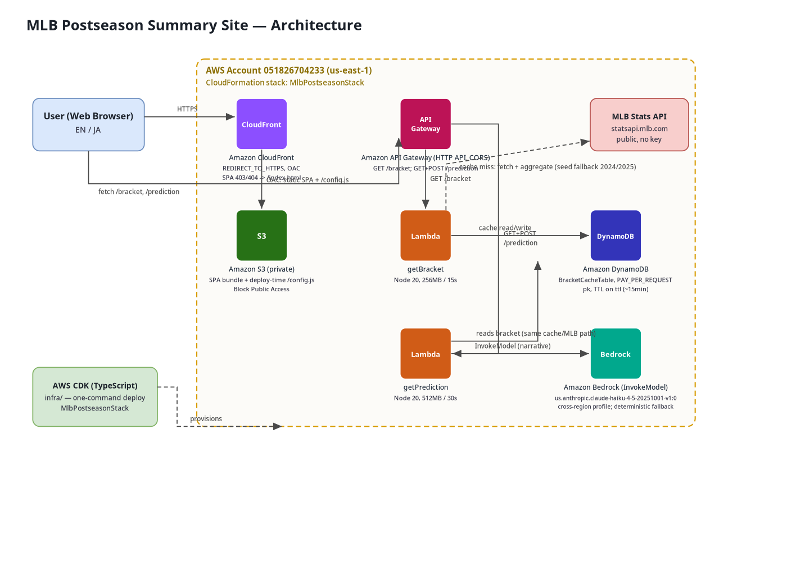

# MLB Postseason Summary Site

**English** | [日本語](README.ja.md)

A lightweight, serverless web app that gives a **graphical summary of the MLB postseason**
plus an **AI-powered win/loss prediction** for any series. Built end to end in TypeScript
and deployed to AWS with one command via AWS CDK.

This project is a submission for the [Kiro University Challenge](https://kiro.dev/2026/university/)
final exam.

> **Judges:** see [DEMONSTRATED_LESSONS.md](./DEMONSTRATED_LESSONS.md)
> for how each of the seven required lessons and the two bonuses is demonstrated,
> with links to the relevant files.

---

## Overview

- **Multiple seasons with a season selector** — the app is year-aware. The current year
  is **2026** and the selector offers **2024, 2025, and 2026** (default 2026). Past
  seasons (2024, 2025) are **results-only**; the current season (2026) is the live,
  in-progress one.
- **Graphical postseason view** — a bracket from the Wild Card round through the World
  Series, showing each series, both teams, the series score, and status.
- **Series detail** — per-series, game-by-game results (available for every season).
- **Standings / summary panel** — participating teams grouped by league with their
  postseason progress.
- **Win/loss prediction (added feature, current season only)** — for a series in the
  in-progress season, the app shows a favorite, a win probability, and an **AI-generated
  narrative** explaining the pick. The prediction feature is offered **only for the
  current (in-progress) season**; completed seasons simply show their final results.

The numeric win probability is produced by a deterministic model in code (so it is
explainable and unit-tested); **Amazon Bedrock** turns it into prose using a
**selectable model** (the **Amazon Nova** family, default **Nova Lite**, with
**Anthropic Claude** also available), and the narrative is **localized to the UI
language (EN / JA)**.

- **Dark mode and accessibility** — a **System / Light / Dark** theme toggle that follows
  your OS preference (persisted to `localStorage`), WCAG-AA contrast in both themes,
  automatic team-badge text color, full **keyboard navigation** of the bracket, and
  **screen-reader labels** — verified by an automated **axe** check across light and dark.

No authentication. Public, read-only. Not a betting product.

---

## Architecture



The editable diagram is [`docs/architecture.drawio`](docs/architecture.drawio) (open with
draw.io / diagrams.net). A vector export [`docs/architecture.svg`](docs/architecture.svg)
and a PNG (`docs/architecture.png`) are included.

- **Frontend:** React + TypeScript (Vite), hosted on **S3** (private, Origin Access
  Control) and served through **CloudFront**.
- **Backend:** two **AWS Lambda** functions (Node 20) behind an **API Gateway HTTP API**
  with CORS. Routes: `GET /bracket`, `GET /prediction`, `POST /prediction`.
- **Data:** **DynamoDB** caches the aggregated bracket JSON per season.
- **AI:** **Amazon Bedrock** (`InvokeModel`) generates the prediction narrative from a
  selectable model (Amazon Nova micro/lite/pro, default Nova Lite; Anthropic Claude also
  available), localized to the UI language.
- **IaC:** **AWS CDK (TypeScript)** provisions everything for one-command deploy.

### Monorepo layout (npm workspaces)

| Workspace       | Package         | Purpose                                             |
| --------------- | --------------- | --------------------------------------------------- |
| `shared/`       | `@mlb/shared`   | Domain types (`Bracket`, `Series`, `PredictionResponse`), `TEAMS`, the season config (`CURRENT_YEAR`, `SELECTABLE_SEASONS`, `seasonMode`), and the bundled 2024 + 2025 seed datasets. |
| `backend/`      | `@mlb/backend`  | Lambda handlers, MLB client + aggregation, prediction model, Bedrock narrative. |
| `frontend/`     | `@mlb/frontend` | React + Vite SPA (bracket, standings, prediction panel) with committed SVG image assets. |
| `infra/`        | `@mlb/infra`    | AWS CDK app (S3 + CloudFront, HTTP API + Lambda, DynamoDB, Bedrock IAM). |

---

## MLB data strategy

1. **DynamoDB cache first.** `getBracket` looks up `pk = BRACKET#<season>` in DynamoDB.
   A fresh cached bracket (TTL on the `ttl` attribute, ~15 min) is returned directly.
2. **MLB Stats API on cache miss.** The Lambda fetches the public MLB Stats API
   (`https://statsapi.mlb.com/api/v1/schedule/postseason?sportId=1&season=YYYY`, no API
   key), aggregates games into series, and writes the result back to the cache.
3. **Seed fallback (completed seasons).** If the live API is unreachable, the bundled
   `@mlb/shared` seed datasets are used so the app stays deterministic in tests and demos.
   The fallback now covers **both 2024 and 2025**:
   - `postseason-2024.json` — Dodgers defeated Yankees 4-1.
   - `postseason-2025.json` — Dodgers defeated Blue Jays 4-3 (real results aggregated from
     the live MLB Stats API).

   The frontend also falls back to these seeds if the bracket request fails, so the demo
   renders offline.
4. **2026 is the live / current season.** The current year (2026) has no bundled seed and
   is fetched live. The app gracefully handles an empty or not-yet-started 2026 postseason
   (showing a "has not started yet" message instead of a broken bracket), and aggregation
   tolerates the placeholder teams the live schedule returns for not-yet-determined rounds.

### Seasons and the prediction feature

The season selector offers 2024, 2025, and 2026 (default 2026). A season strictly before
the current year is **results-only**: the prediction UI is hidden and the `/prediction`
endpoint returns a results-only response (`mode: 'results'`) instead of a numeric
prediction. The current season (2026) is **predictable**, so the prediction feature is
offered for its in-progress series; `/prediction` returns `mode: 'prediction'` for a
started series or `mode: 'upcoming'` when a series has not started yet. All variants are
returned with HTTP 200 and the frontend branches on `mode`.

### Live auto-refresh for the in-progress season

While the current, in-progress season has a live series, the bracket keeps
itself up to date in the background without a page reload. The app shows a
localized **"last updated"** relative time (e.g. "Last updated: 2 minutes ago" /
"最終更新: 2分前") derived from the bracket's `updatedAt`, and a manual
**Refresh** button you can press at any time (disabled with an "Updating…"
affordance while a refresh is in flight). Auto-refresh is deliberately scoped:

- It **polls only for the current, in-progress season** — specifically a
  predictable season (`CURRENT_YEAR`) whose bracket has at least one
  `in_progress` series. Results-only seasons (2024, 2025) and predictable
  seasons with no live series never poll; they still show the last-updated line
  and the manual Refresh button, but no automatic background fetch runs.
- The interval is a documented **60s** (`AUTO_REFRESH_INTERVAL_MS`), well under
  the backend's ~15 min bracket cache TTL so polling never out-paces the data.
- It **pauses when the tab is hidden** (Page Visibility API) and, when you
  return to the tab, refetches immediately and resumes.
- Refreshes are **flicker-free**: the bracket stays mounted (your scroll
  position and selected series are preserved) and never flashes the full loading
  screen. If a refresh fails, the previously loaded data stays on screen with a
  small, unobtrusive notice instead of a full error page.

The feature is frontend-only, in `frontend/src/relativeTime.ts`,
`frontend/src/useAutoRefresh.ts`, and `frontend/src/pages/HomePage.tsx`.

### Regular-season win pct drives the prediction

The prediction blends series progress with each team's **real regular-season win
pct**. On a prediction, the backend fetches the MLB Stats API standings
(`https://statsapi.mlb.com/api/v1/standings?leagueId=103,104&season=YYYY`),
aggregates them into a per-team win-pct map with a pure, unit-tested function,
and feeds that map into the model. The map is **cached per season in DynamoDB**
under `pk = STANDINGS#<season>` with the same ~15 min TTL as the bracket cache
(no infra change, since the table uses a single partition key). If the standings
fetch, parse, or aggregation fails for any reason, the model falls back to a
**neutral 0.5** for the affected teams and **still returns a prediction**, so a
standings outage never turns a prediction into an error. The `mode: 'prediction'`
response also carries an additive `metrics` object (each team's win pct), and the
prediction panel shows a localized **"Prediction basis"** block with each team's
regular-season win pct (or "Not available" when unknown), so the basis is
explainable. Only the win-pct signal is wired today; there is no Pythagorean
(run-differential) or last-10 signal.

### Model accuracy / backtest

A client-side **Model accuracy** page (at `/accuracy`, reachable from a nav link
in the header on every season) shows how well the deterministic prediction model
called the **completed** 2024 and 2025 postseasons. It is backed by a pure,
deterministic **backtest engine** in `@mlb/shared` that replays the bundled seed
brackets through the same `predict()` the app uses.

- **Deterministic, seed-only.** The engine imports only pure shared code and the
  bundled seed JSON (2024 / 2025). The page computes everything **client-side**
  in the browser — there is **no backend endpoint and no infrastructure
  change** — so the numbers are reproducible and the exact `hitRate` /
  `brierScore` at a known accuracy are pinned in unit tests.
- **Amazon Bedrock is NOT called.** The backtest never touches Bedrock,
  DynamoDB, or the network; the engine structurally cannot reach them (it only
  imports pure code + seed data).
- **"Predict at the end of game k".** For each completed series the model
  predicts after every game (game 1, game 2, …) using only the games played so
  far, and each prediction is scored against the team that actually won the
  series. The page compares results across the accuracy settings
  `0, 0.25, 0.5, 0.75, 1` for 2024, 2025, and the two combined.
  - **Caveat:** each series includes a snapshot taken at the end of every game,
    including the final, already-decided game. That last snapshot is a settled
    outcome rather than a prediction, so the headline hit rate includes decided
    results and overstates mid-series predictive skill.

**Metric definitions** (shown on the page, localized EN/JA):

- **Hit rate** — the fraction of game-by-game snapshots where the team the model
  favored was the eventual series winner. Higher is better; range 0 to 1.
- **Brier score** — the **mean squared error between the predicted probability of
  the eventual series winner and 1**. Range 0 to 1, **lower is better**, and **0
  is a perfect score**.
- **Calibration** — **groups predictions into probability buckets and compares
  the mean predicted probability in each bucket to the actual win rate** observed
  in that bucket. A well-calibrated model has predicted and empirical rates that
  match.

### Finished series: prediction turned OFF

Even within the current, predictable season, a series that has already finished
(`status === 'final'`) shows its **final result, never a speculative prediction**. This is
enforced on both tiers:

- **Backend:** `/prediction` resolves the series and, if it is `final`, returns
  `mode: 'results'` **without** running the prediction model or invoking Bedrock.
- **Frontend:** a finished series card does **not** render the "Predict winner" button and
  surfaces a **"View series detail"** link instead, so no numeric win probability is ever
  shown for a completed series.

### Configurable prediction accuracy

The prediction panel exposes a labeled **accuracy** slider that tunes how confident the
model is. `accuracy` is a sharpness control in the range **`[0, 1]`** with a **default of
`0.5`**:

- `0.5` (default) is an **identity** transform — the historical model behavior, unchanged.
- **Higher** accuracy (> 0.5) sharpens the pick toward the favorite (more confident, up
  toward `0.95`).
- **Lower** accuracy (< 0.5) softens it toward a coin flip (`0` collapses the favorite to
  exactly `0.5`).

The win probability **always stays within `[0.5, 0.95]`** for any accuracy value (an
invariant covered by property tests). The control is threaded end to end: the slider
appends an **`&accuracy=<value>`** query parameter to `GET /prediction` (also accepted in
the `POST /prediction` body), e.g.
`GET /prediction?seriesId=...&season=2026&accuracy=0.8`. A missing or invalid `accuracy`
falls back to the default and never causes a `400`. Dragging the slider debounces and
re-requests the prediction, updating the favorite, probability, and narrative live.

### Japanese / English language switch

The UI ships a **JA/EN language toggle** in the header. **Japanese is the default**; the
choice is persisted to `localStorage` (key `mlb.lang`) and restored on reload. All
user-facing strings are localized (title/subtitle, season label, statuses, round names,
legend, standings, the prediction panel including the accuracy control, the game-detail
toggle, and the detail page). Unknown/preview team ids (not in the `TEAMS` map) render a
localized placeholder — EN `TBD (#<id>)`, JA `未定 (#<id>)` — rather than a raw
`Team <id>`.

### Localized AI narrative and selectable Bedrock model

The prediction narrative is **localized** and the **Bedrock model is selectable**:

- **Localized (EN / JA).** The narrative is generated in the current UI language for both
  the Bedrock prompt and the deterministic fallback. The SPA sends its UI language on each
  `/prediction` request (`&lang=en|ja`); a bare API caller that omits `lang` defaults to
  English. Team club names stay in English by convention; only the surrounding prose is
  localized.
- **Model selector.** A labeled selector next to the accuracy slider lets you pick the
  Bedrock model. The options are the **Amazon Nova** family — **Nova Micro**, **Nova Lite**
  (default), **Nova Pro** — plus **Anthropic Claude Haiku**, which remains available.
  (Amazon Titan is not offered: it has no text-generation model in us-east-1, only
  embeddings.) The choice is sent as `&model=<id>` and validated server-side against a
  shared allowlist; an unknown/missing model falls back to the default and never causes a
  `400`.
- **Per-provider adapter + fallback.** The InvokeModel request/response JSON differs per
  provider, so the backend shapes the Anthropic messages body vs the Amazon Nova
  `messages` + `inferenceConfig` body and parses each provider's response. On any Bedrock
  error (including a model not yet access-enabled), the endpoint returns a deterministic
  templated narrative in the requested language with the `model` field suffixed
  `(fallback)`, so a prediction is always returned at HTTP 200.

> **Deploy-time caveat (Bedrock model access).** IAM authorizes the InvokeModel call for
> all selectable models, but each model must ALSO be **access-enabled** for Bedrock in the
> deploy account/region (us-east-1) to return generated text at runtime; model access only
> surfaces at invoke time. If a selected Amazon Nova model is not access-enabled, the
> deterministic fallback keeps `/prediction` working (HTTP 200). Verify model access for
> every selectable model in the Bedrock console on redeploy for live generation.

### Data-integrity warnings

The `GET /bracket` response is scanned for **data-integrity problems**: a finished series
or a decided game that still references an undetermined/TBD **placeholder team** (a team id
absent from the `TEAMS` map). Placeholder teams are normal in not-yet-started parts of the
2026 bracket, but a *finished* context should reference the two real teams that played.
Any findings are surfaced as a non-blocking `integrityWarnings` array on the HTTP 200
response and logged server-side (Lambda `console.warn`); the SPA shows a non-blocking,
localized banner and still renders the bracket. A clean bracket shows no banner.

### Game-detail toggle and the finished-series detail page

- **Collapsed-by-default game detail.** Each series card hides its game-by-game list
  behind a per-series **Show games / Hide games** toggle that starts collapsed. This keeps
  the bracket compact and is the primary fix for the previously uneven ("gatagata") card
  heights and column alignment.
- **Finished-series detail page + client-side routing.** The SPA uses path-based
  (history) client-side routing (`react-router-dom`). A finished series links to a
  dedicated detail page at `/season/:season/series/:seriesId` showing the full
  game-by-game result; an unknown id shows a friendly "Series not found" page. Path-based
  deep links work in production because CloudFront rewrites `403`/`404` responses to
  `/index.html` (HTTP 200), so the SPA shell loads and renders the requested route.

### Dark mode and accessibility

The UI ships a **System / Light / Dark** theme toggle in the header (on every page):

- **Follows your OS preference.** The default is **System**, which tracks the OS
  `prefers-color-scheme` live (changing your OS theme flips the app without a reload).
  Picking **Light** or **Dark** overrides it. The choice is persisted to `localStorage`
  (key **`mlb.theme`**, values `system | light | dark`) and restored on reload. An inline
  script applies the theme before the app paints, so there is no light-to-dark flash. The
  resolved theme is applied as `data-theme` on `<html>`, so all colors (defined as CSS
  variables for a light and a dark palette) switch together.
- **WCAG-AA contrast in both themes.** Every foreground/background pair is chosen to clear
  WCAG AA (≥ 4.5:1 for normal text, ≥ 3:1 for large text and UI affordances) in both the
  light and the dark palette, and each team badge's abbreviation text color is **computed
  automatically** from the badge color so it always reads on the disc.
- **Keyboard navigation.** The bracket uses a **roving-tabindex** model: Tab enters the
  bracket once, then the **arrow keys** move focus between series cards (within a round
  column and across columns), a visible focus ring shows the position, and **Enter / Space**
  on a finished series opens its detail page. Mouse users are unaffected.
- **Screen-reader labels.** Each series card exposes an accessible label announcing the
  two teams, the series status, and the score, so the bracket is understandable without
  sight.
- **Automated accessibility check.** A Playwright end-to-end test
  (`frontend/e2e/a11y.spec.ts`) runs **[`@axe-core/playwright`](https://www.npmjs.com/package/@axe-core/playwright)**
  (added as a `@mlb/frontend` devDependency) over the home bracket, a finished-series
  detail page, and the accuracy page in **both the light and the dark theme**, asserting
  **zero `serious`/`critical` violations**. It also captures a dark-mode home screenshot
  (into the gitignored `frontend/test-results`) for visual review of the connectors and
  logos.

## Amazon Bedrock usage

The win probability is computed by a transparent heuristic in `backend/src/predict/`
(current series progress blended with regular-season win pct, clamped to `[0.5, 0.95]`).
**Bedrock** (`BEDROCK_MODEL_ID`, default `us.amazon.nova-lite-v1:0`, a cross-region
inference profile) is then asked to explain the pick in a concise 2–3 sentence narrative,
in the requested language (EN / JA). The model is selectable per request from a shared
allowlist — the **Amazon Nova** family (`us.amazon.nova-micro|lite|pro-v1:0`, default Nova
Lite) plus the **Anthropic Claude** Haiku inference profile — and a small per-provider
adapter shapes the request/response JSON for each provider. If Bedrock errors (including a
model not access-enabled in the region), the endpoint degrades gracefully to a
deterministic templated narrative in the same language, so a prediction is always
returned. Override the default model at deploy time with
`cdk deploy --context bedrockModelId=<id>`.

## Image assets

The UI uses **real, committed SVG image assets** (not emoji) under
`frontend/src/assets/` — a brand logo, a baseball/diamond hero, league/World Series marks,
plus generated team-color SVG badges driven by per-team colors. SVGs keep the repo light
while satisfying the "actual image assets" requirement.

---

## Prerequisites

- **Node.js 20+** (the local toolchain may be Node 22; code targets the Node 20 Lambda
  runtime).
- **An AWS account** with credentials active in your shell/session (profile, SSO, or
  environment variables).
- **Amazon Bedrock model access granted** for the selectable models **in the deploy
  region (us-east-1)**. The default is **Amazon Nova Lite**
  (`us.amazon.nova-lite-v1:0`, a cross-region inference profile); the other selectable
  options are Nova Micro, Nova Pro, and the Anthropic Claude Haiku profile
  (`us.anthropic.claude-haiku-4-5-20251001-v1:0`). Enable model access for the models you
  intend to use in the Bedrock console before deploying — **model access only surfaces at
  runtime**, and a model that is not access-enabled falls back to the deterministic
  narrative. The defaults are inference-profile ids (prefix `us.`) because these
  current-generation models are invoked on-demand through an inference profile; the
  Lambda's IAM policy grants `bedrock:InvokeModel` on the inference profiles plus the
  underlying foundation models across the US regions they may route to, which covers both
  the Amazon Nova models and the Claude profile. Override the default model with
  `cdk deploy --context bedrockModelId=<id>`.
- The CDK bundles Lambdas with **esbuild** (no Docker required).

> **Note:** AWS credentials must be active **and** Bedrock model access must be granted
> in the region (us-east-1) for each selectable model you want to generate from before you
> deploy; model access only surfaces at runtime, and the deterministic fallback keeps the
> endpoint working otherwise. The repository build itself performs no live AWS or Bedrock
> calls.

---

## One-command deploy

From the repo root, with active AWS credentials:

```bash
npm install && npm run build && npm run deploy
```

- `npm install` — installs all workspaces.
- `npm run build` — builds in dependency order: `shared → backend → frontend → infra`.
  The frontend must be built **before** deploy because CDK packages `frontend/dist` as the
  S3 website source at synth time.
- `npm run deploy` — re-runs the ordered build, then `cdk deploy` for the `@mlb/infra`
  workspace.

### First-time setup (CDK bootstrap)

If this is the first CDK deploy into the target account/region, bootstrap once:

```bash
cd infra
npx cdk bootstrap
npx cdk deploy
```

(From the repo root you can also run `npm run bootstrap` then `npm run deploy`.)

After deploy, the stack prints outputs:

- **ApiUrl** — the HTTP API base URL.
- **DistributionDomainName** — the CloudFront domain to open in a browser.
- **BucketName** — the S3 bucket hosting the SPA.
- **TableName** — the DynamoDB cache table.

### How the SPA finds the API (no rebuild needed)

The same static bundle is pointed at any deployed API at **deploy time**: CDK writes a
`/config.js` at the bucket root containing
`window.__API_BASE_URL__ = "<ApiUrl>";`, loaded by `index.html` before the app bundle.
At runtime the SPA reads `window.__API_BASE_URL__`, falling back to the build-time
`VITE_API_BASE_URL` and finally to a local default.

### Verify without deploying

To validate the CloudFormation template without touching AWS:

```bash
npm run build        # ensures frontend/dist exists for the SPA asset
npm run synth        # cdk synth -> infra/cdk.out (no AWS calls)
```

---

## Local development

```bash
npm install
npm run dev -w frontend     # Vite dev server (http://localhost:5173)
```

By default the frontend targets `http://localhost:3000` for the API. Options for data:

- **Offline / seed data:** if the bracket request fails, the SPA automatically falls back
  to the bundled `@mlb/shared` seeds (2024 and 2025), so the completed-season brackets
  render without a backend.
- **Point at a deployed API:** build with `VITE_API_BASE_URL=<ApiUrl> npm run build -w frontend`,
  or set `window.__API_BASE_URL__` via `/config.js` (as the deployed site does).

Run the test suites and typecheck across the monorepo:

```bash
npm test          # Vitest across workspaces (AWS SDK + MLB API mocked)
npm run typecheck # strict TypeScript across all workspaces
```

---

## How steering files map to Kiro University lessons

The steering set under `.kiro/steering/` drives the build and demonstrates the exam's
required lessons:

| Steering file                 | What it drives                                              | Kiro University lesson theme |
| ----------------------------- | ----------------------------------------------------------- | ---------------------------- |
| `kiro-university.md`          | Challenge rules, scoring, and how the build maps to lessons | Spec/steering-driven development |
| `product.md`                  | Product vision, features, constraints, non-goals            | Requirements → spec quality  |
| `tech.md`                     | Approved AWS architecture and TypeScript toolchain          | Infrastructure as Code (CDK) + AWS integration |
| `structure.md`                | Monorepo layout and conventions                             | Project structure / maintainability |

Concretely, the lessons are demonstrated by:

- **Spec / steering-driven development** — this steering set plus discrete planned
  features under `.agents/tasks/`.
- **Amazon Bedrock integration** — the win/loss prediction narrative is a real AI
  integration (selectable Amazon Nova / Claude models via a per-provider adapter,
  localized EN/JA, with a deterministic fallback), not a toy.
- **Infrastructure as Code** — AWS CDK provisions the entire stack for one-command deploy.
- **Testing** — Vitest unit tests cover prediction logic and MLB aggregation with AWS and
  the MLB API mocked (no live calls in CI).
- **Documentation** — this README covers one-command deploy and local development.

---

## License

Illustrative project for the Kiro University Challenge. Not affiliated with MLB. The MLB
Stats API is used under its public terms; predictions are illustrative, not betting advice.
